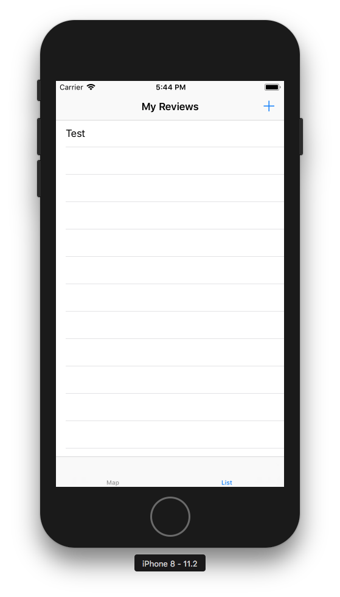
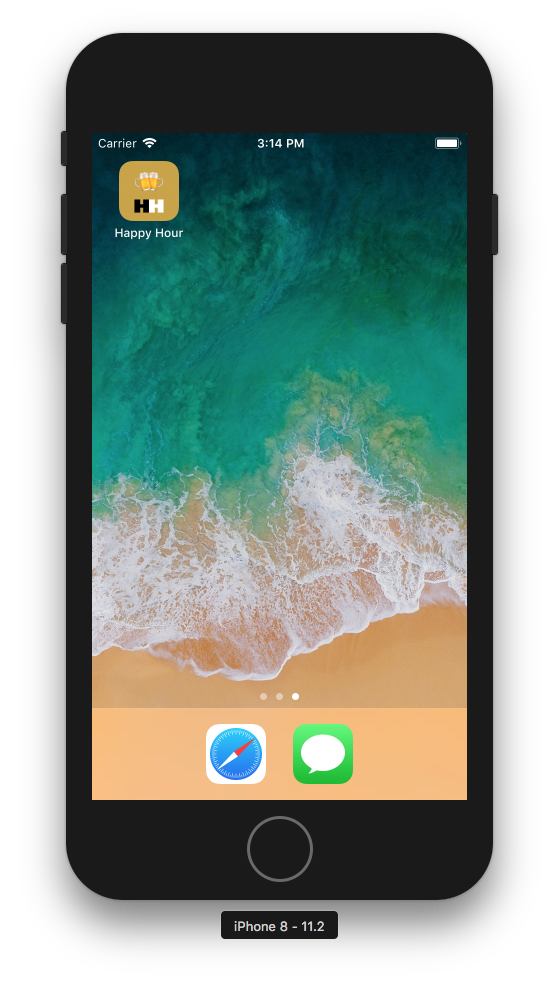

# Happy Hour
Paul DeSimone & Nick Federico

A bar/brewery review app that allows users to create logs of their favorite drinks and
locations. This app is designed for beer enthusiasts that enjoy finding new venues to explore!

### Features (Proposed)

1. An interactive map with pins that represent a location that has been reviewed
2. Users can click on a pin of a location and read user reviews
3. Users can create new reviews for a new/existing location
4. A list of the top reviewed locations with various filter to search with

## Prototype 1

### Initial Sketches

### Current Features

1. Primary navigation is working
2. Map screen displays world map
3. List screen has placeholder for future data
4. Clicking on a list item will bring up its information screen
5. Clicking the '+' will bring you to where the form screen will be to add a new review

## Prototype 2

For the second prototype we reworked the Add Review page so that the user can now 
enter all info for a review. Data entered within the form will be taken and used to 
create a JSON file, where all the review data will be stored. The app also now has a launch 
screen and icon, along with themed UI.

